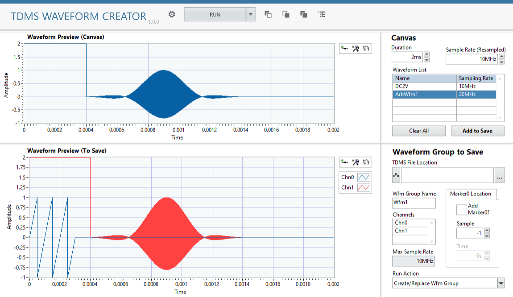

# TDMS Waveform Creator Plugin (Work In Progress)

This plugin is a simple TDMS waveform creator. It allows to:

*   Add standard waveform - such as DC, sine
*   Add arbitrary waveform from other file. Supported formats: \*.tdm, \*.tdms, \*.csv

## Software Dependencies

*   InstrumentStudio Pro (2025 Q4 or higher)
*   LabVIEW 2025