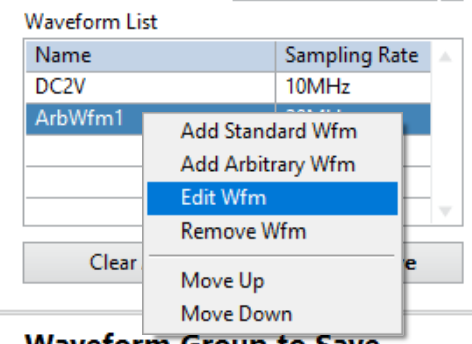

# TDMS Waveform Creator Plugin
## Overview

This plugin is a simple TDMS waveform creator. It allows you to:

*   Add standard waveforms—such as DC, sine
*   Add arbitrary waveforms from other files. Supported formats: \*.tdm, \*.tdms, \*.csv

## How To Use
### (1) Cascade Waveforms in Canvas

Canvas refers to the graphs and controls on the upper pane. You draft and edit in the canvas region first before adding it to the `Waveform Group To Save` in the bottom pane. 

As shown below, specify the total duration and overall sample rate in the Canvas. When you right-click the `Waveform List` table to add a standard or arbitrary waveform, a dialog will prompt you to configure the waveform. 

*Right-click the `Waveform List` to add a waveform*

*Create Standard Waveform Dialog. Set Pre or Post Delay to add zeros before or after the waveform*

*Create Arbitrary Waveform Dialog. Change the `Read From Row/Wfm Index` to select the row to start (CSV) or waveform to read (TDMS and TDM). Uncheck `Suggest Naming?` to use a custom waveform name instead of the file name.*

The Canvas cascades the waveforms in the `Waveform List` in the listed order. You can right-click an added waveform in the list to edit, remove, or move up and down. 

Note that the sample rate and waveform length of each waveform are persisted as configured in the dialog. After cascading them, the waveform will be resampled at the rate specified in Canvas, and the total cascaded waveform length will always equal the `Duration` specified in the Canvas. You can adjust them anytime and preview the final waveform in the Canvas graph. 

After you finish, click the `Add To Save` button to copy it to the `Waveform Group To Save` pane. 

### (2) Build and Save the Waveform Group into a TDMS File
The [TDMS file format](https://www.ni.com/en/support/documentation/supplemental/06/introduction-to-labview-tdm-streaming-vis.html) organizes data in three levels of hierarchy: `Root`, `Group`, and `Channel`. Waveforms are stored in `Channel`s. When you click the **RUN** button of the plugin, it will save the data as a TDMS `Group` containing multiple `Channel`s. 

The waveforms added from the Canvas will be added as new `Channel`s. You must ensure there are no repeated `Channel` names. 

You can right-click an item in the Channel to rename, edit in Canvas, remove, or move up or down. 

If you specify an existing TDMS file, the **RUN** action will behave differently depending on the `Run Action` selected: 
 
- *Create/Replace Wfm Group* - if the TDMS file has the same *Wfm Group Name*, the existing one is deleted and replaced with the new one
- *Create/New Wfm Group* - if the TDMS file has the same *Wfm Group Name*, the *Wfm Group Name* is renamed with a different number suffix that does not conflict with existing TDMS group names. For example, if *Wfm1* exists, it is renamed to *Wfm2* or higher as long as there is no conflict with the TDMS group name.

### Optional: Setting Marker0 Location
If the `Add Marker0?` checkbox is checked, a custom property called `Marker0InSeconds` is created under the TDMS `Group`. Use this to specify the timing of the Marker0 event when generating the waveform using the [NI FGEN Arbitrary Sequence Mode Plugin](https://github.com/NI-Measurement-Plug-Ins/Fgen-ArbSeqMode-Plugin). After modifying, click the **RUN** button to save it. 

## Software Dependencies

*   InstrumentStudio Pro (2025 Q4 or higher)
*   LabVIEW (2025 Q3 or higher)